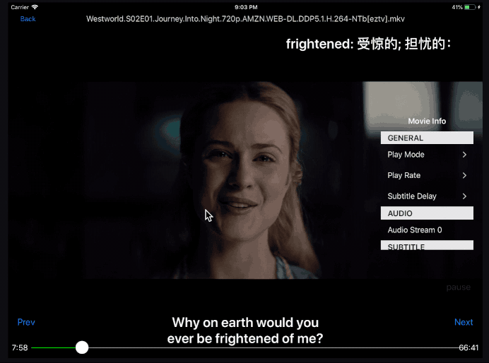
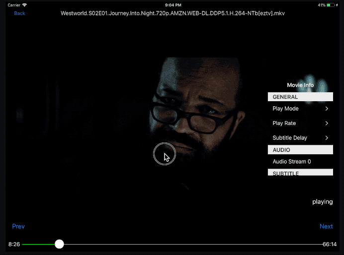
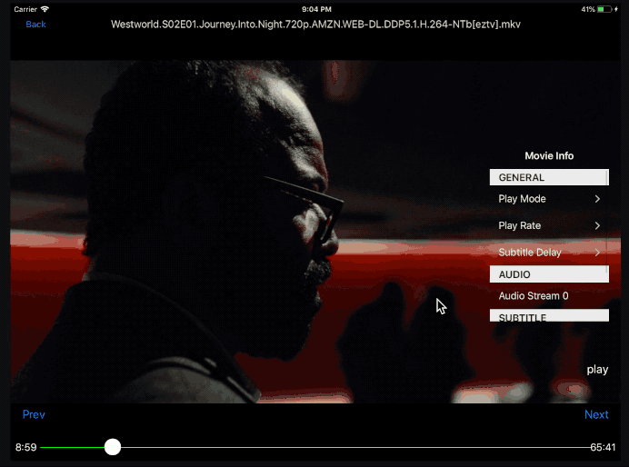
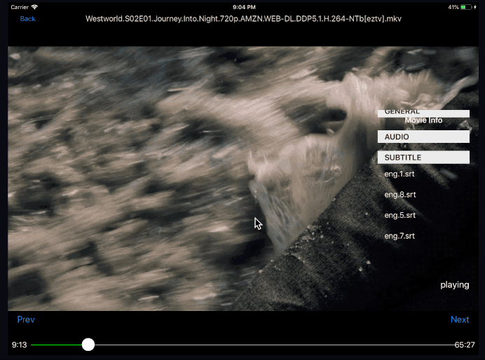
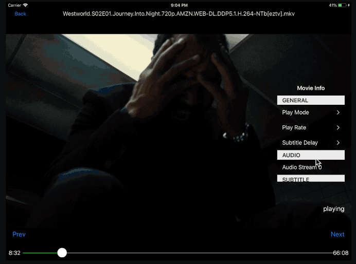

EPlayer
=======

Another iOS Video player application (Swift).

It's an English(Languages) learning oriented Video player, which helps
you download subtitles and looks up words you are unfamiliar with.
That would help those who want to learn a second language by watching
videos along with subtitles of that language only.

With my rough experience learning English, it occurs to me that I need
a tool that helps me stand out the words I don't familiar with when
watching English videos and better it interprets for me so that I can
consume tons of sitcoms, in the meantime, memorize that vocabulary
naturally. And I hope this method could apply in other languages learning.

## Features

* Hardware/software decoding support for M264 (others may be supported too, though
  I didn't test)
* Mainstream video formats support
* iOS Simulator(x86) support
* iPhone/iPad(armv7/arm64) support and iOS 10.0 higher (Didn't do well with layout
  for iPhone)
* External subtitles support (srt/ass)
* Download subtitles from OpenSubtitles/Xunlei/Shooter
* Subtitle offset tweak (forward/delay)
* Video move forward/afterward
* Video progress history
* Gesture control (forward/afterward/lightness/volume/pause)

## Snapshots

Interpretation

move forward

show/hide control panel

volume/lightness control

pause control

download/tweak subtitles

## Usage

1. Open Xcode -> File/Open EPlayer.xcworkspace
2. Verify your developer certification or let Xcode create one
   automatically for you
3. Plug-in one of your iOS devices or use simulator
4. Choose build target and cmd + r to run this application

**note**: if you're using the device, try to use iTunes to copy some movies through
Filesharing

## Dependencies and Acknowledges

* FFmpeg
* uchardet
* libass
* AlamofireXMLRPC
* GzipSwift

**note**: Dependencies were builtin in this repo

This project isn't a sound video player (though it indeed plays sounds),
neither I am an iOS developer. Lots of works are involved to make it an out-of-box
open-source project (due to iOS platform policy). However, it keeps me accompanied
along with many wonderful videos, so I really hope someone with hands-on skills
and a passion for learning languages could enjoy this. Cheers!

Oh, by the way, it really helps me learn a language named Swift 4.0 :-

## Author

Eric Lin, linxiulei@gmail.com

## License

Not figure it out yet

